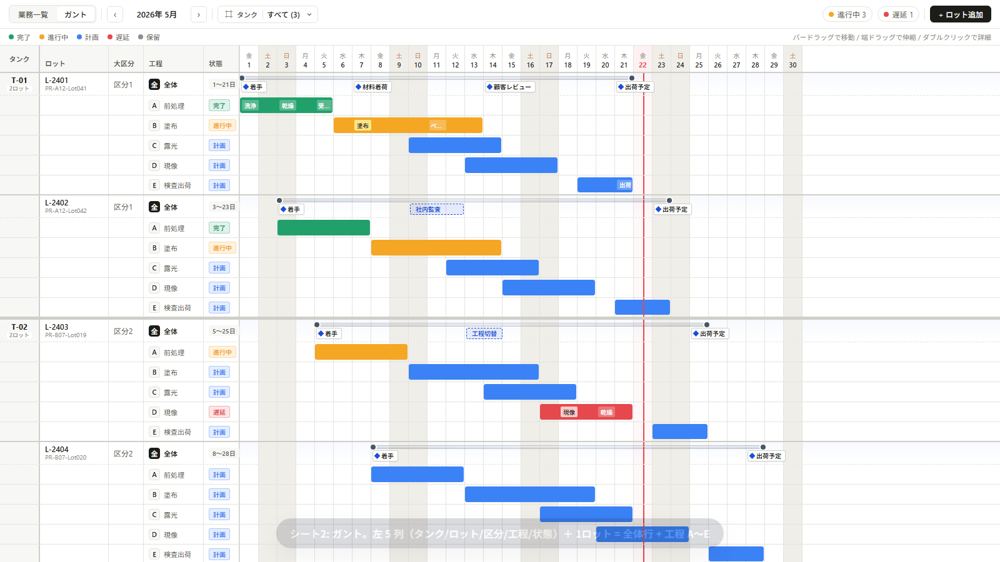
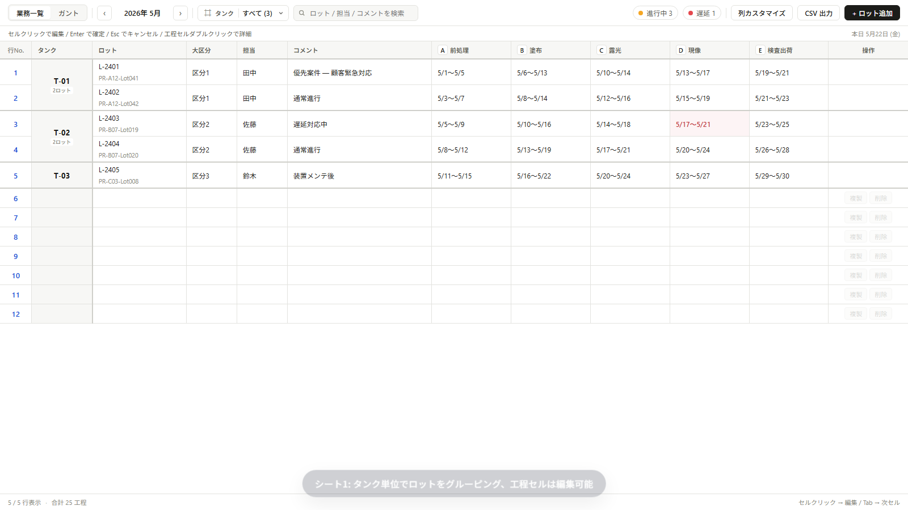
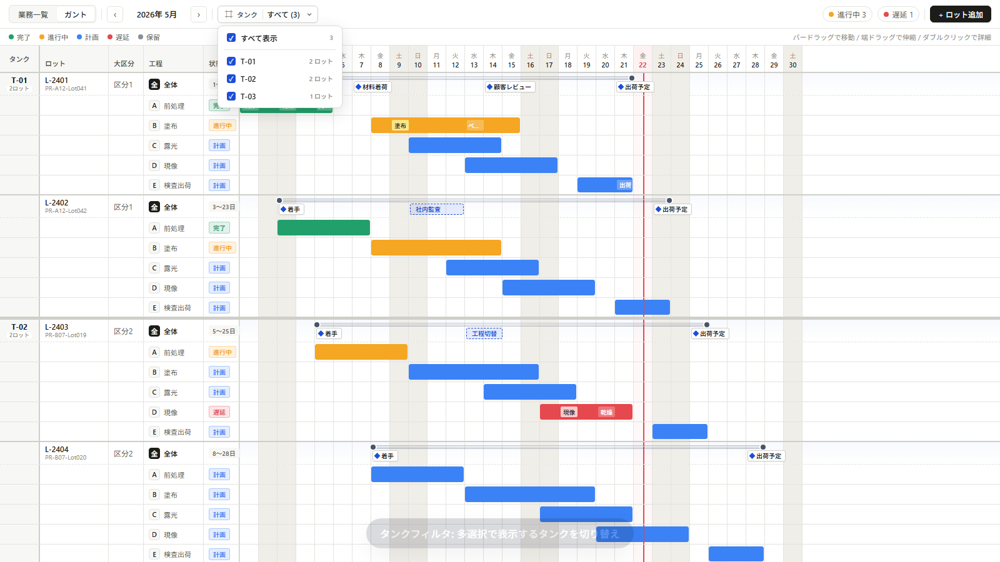
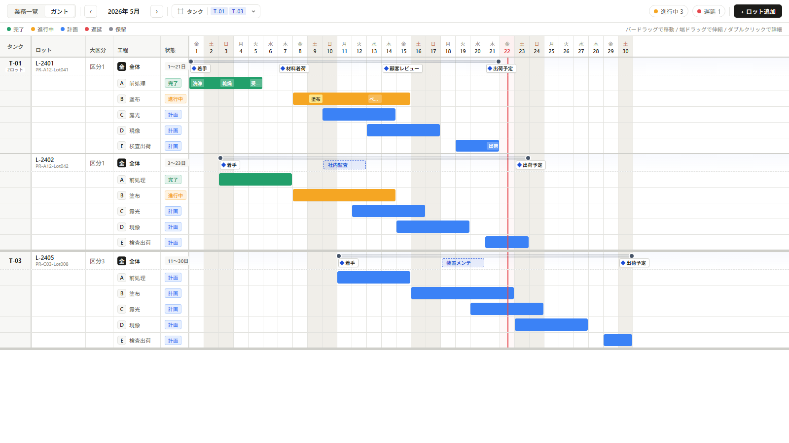
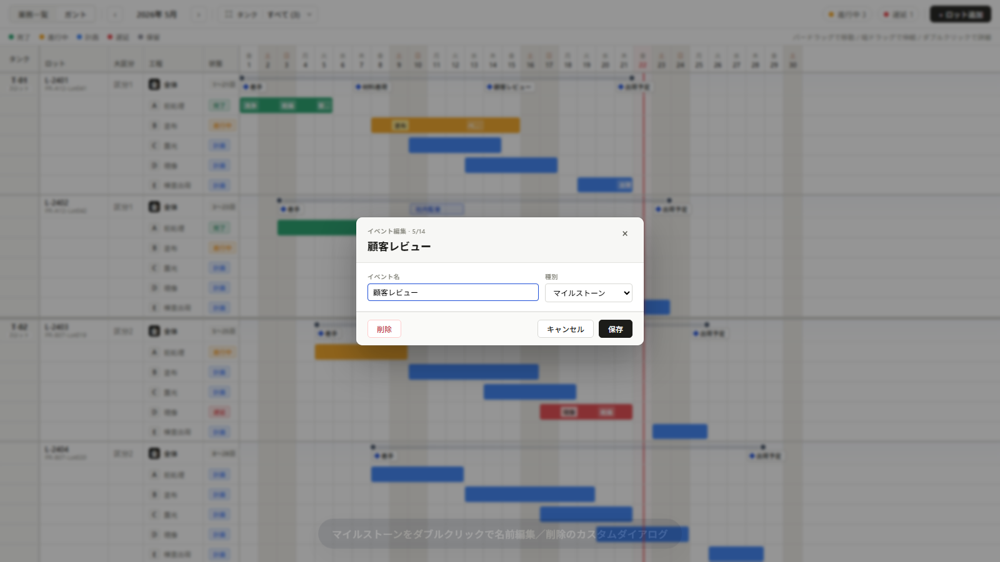
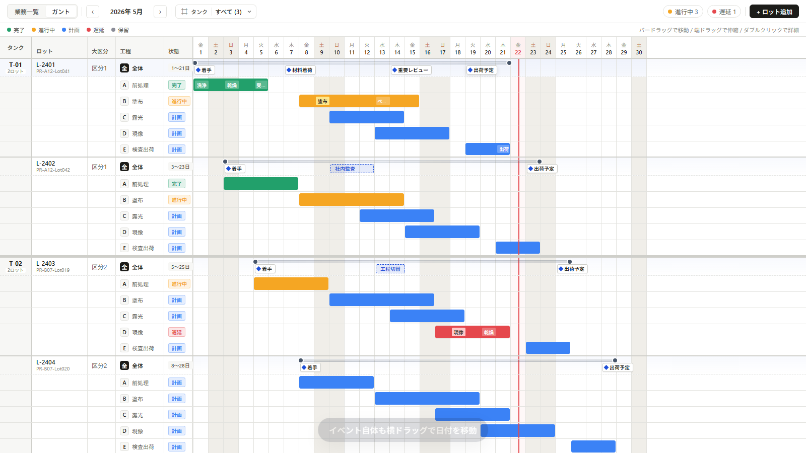
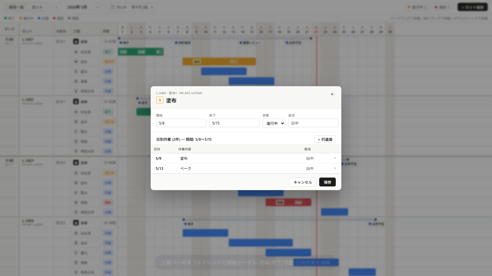

# calendar_app

Excel で運用していた製造ライン業務カレンダー（業務予定表 + ガントチャート）を Web アプリ化したもの。
**シート1（テーブル）とシート2（ガント）の 1モデル 2ビュー** — どちらで編集しても同じ `JobData` を更新するため、Excel の数式同期が不要になる。



▶ **[30 秒の紹介動画 (webm, 3.2MB)](doc/DD/DD-001-8/intro.webm)** — シート1 / ガント / タンクフィルタ / イベント編集 / 工程詳細モーダル を一通り操作

## デモ

| 画面 | キャプチャ |
|---|---|
| **シート1 (業務一覧)** — タンク単位でロットを `rowSpan` マージ、工程セルはクリックで編集 |  |
| **シート2 (ガント)** — 左 5 列 / 1 ロット = 全体行 + 工程 A〜E / status 色付きバー / 日別 subtask chip |  |
| **工程バー ドラッグ** — 横ドラッグで期間移動、両端ドラッグで伸縮 |  |
| **タンクフィルタ** — 多選択ドロップダウン、外側クリックで自動クローズ |  |
| **タンク絞り込み** — T-02 を除外 → T-01 / T-03 のみ表示 |  |
| **イベント編集ダイアログ** — マイルストーン ダブルクリックで名前変更／削除／種別切替 |  |
| **イベント ドラッグ移動** — マイルストーン／期間イベントを横ドラッグで日付変更 |  |
| **工程詳細モーダル** — 工程バー ダブルクリックで開始/終了/状態/日別作業を一括編集 |  |

## 主要機能

- **タンク × ロット のグルーピング**: 同タンクの複数ロットを `rowSpan` マージ（シート1）／同色レーン化（シート2）
- **5 段階の工程ステータス**: 完了 (`done`) / 進行中 (`running`) / 計画 (`planned`) / 遅延 (`overdue`) / 保留 (`blocked`)
- **直感操作のガント**: 工程バー横ドラッグで期間移動、両端で伸縮、ダブルクリックで詳細モーダル
- **マイルストーン / 期間イベント**: 全体行に配置、横ドラッグで日付移動、ダブルクリックでカスタムダイアログ
- **タンクフィルタ**: 多選択ドロップダウンで表示対象タンクを切替
- **1モデル 2ビュー**: シート1 とガントは同じ `JobData` を編集 → サーバ往復で双方向同期

## 技術スタック

| 層 | 採用 |
|---|---|
| BE | Hono + TypeScript |
| ORM | Prisma |
| DB | SQLite (`prisma/dev.db`) |
| FE | React 18 + Vite + TypeScript |
| 状態管理 | TanStack Query |
| バリデーション | Zod (BE/FE 共有) |
| 録画/E2E | Playwright（紹介動画生成、`scripts/record-intro.ts`） |

`c:\repo\nanairoware3` と同構成（DBドライバのみ SQLite に差し替え）。

## セットアップ

```bash
npm install
npx prisma migrate dev --name init   # SQLite DB 初期化
npm run db:seed                      # サンプル 5 ロット (T-01×2 / T-02×2 / T-03×1) 投入
```

紹介動画を作り直したいときのみ:
```bash
npx playwright install chromium      # ブラウザバイナリ取得（初回のみ）
```

## 起動

```bash
npm run dev:all   # BE(3025) + FE(5198) 同時起動
# 個別起動: npm run dev (BE) / npm run dev:fe (FE)
# 停止: npm run dev:kill
```

ブラウザで http://localhost:5198 を開く。

## ディレクトリ

```
calendar_app/
├── prisma/
│   ├── schema.prisma          # Job { rowNo, data:String(JSON), updatedAt }
│   └── dev.db                 # gitignore
├── src/
│   ├── index.ts               # Hono サーバエントリ
│   ├── app.ts                 # ルーティング集約
│   ├── routes/                # API: health, jobs
│   ├── lib/                   # prisma client, Zod schemas (BE/FE 共有)
│   └── client/
│       ├── pages/             # SheetPage(テーブル) / GanttPage(ガント)
│       ├── components/        # TankFilter / JobDetailModal / EventEditDialog
│       ├── lib/               # api.ts, dateUtils.ts
│       └── styles.css         # デザイントークン (Variant A: Refined Excel)
├── scripts/
│   ├── seed.ts                # シードデータ投入
│   ├── record-intro.ts        # 紹介動画 (webm) + キャプチャ 自動生成
│   ├── dev-start.sh / dev-kill.sh
│   └── dd-index-gen.sh        # DD索引自動生成
└── doc/
    ├── DD/                    # 設計書本体
    ├── archived/DD/           # 完了アーカイブ
    └── templates/             # DDテンプレート
```

## データモデル

UI 固めの段階では Prisma の `Job` テーブルは `data: String` (JSON) のまま動的に持ち、中身は Zod スキーマで検証する。

```ts
// src/lib/schemas.ts
JobData = {
  tank: string | null,            // 'T-01' 等。シート1/2 のタンクグループ化に使用
  lotId: string | null,           // 'L-2401' 等。表示用 ID
  lotName: string | null,         // 'PR-A12-Lot041' 等。サブテキスト
  owner: string | null,           // 担当者
  priority: '高' | '中' | '低' | null,
  category: string | null,        // 大区分
  comment: string | null,
  steps: {
    name: 'A'|'B'|'C'|'D'|'E',    // 工程コード
    label: string | null,          // '前処理' '塗布' '露光' '現像' '検査出荷'
    status: 'done'|'running'|'planned'|'overdue'|'blocked' | null,
    startDate: 'YYYY-MM-DD',
    endDate: 'YYYY-MM-DD',
    color?: string,                // ステータス色を上書きしたいときのみ
    notes: { id, startDate, endDate, text, color? }[],   // 日別作業 (subtask)
  }[],
  events: {
    id: string,
    startDate: 'YYYY-MM-DD',
    endDate: 'YYYY-MM-DD',
    text: string,
    color?: string,
    kind: 'milestone' | 'event',
  }[],
}
```

API:
- `GET /api/jobs` → 全件
- `GET /api/jobs/:rowNo` → 1件
- `PUT /api/jobs/:rowNo` → upsert (`JobData` 丸ごと送信)
- `DELETE /api/jobs/:rowNo` → 1件削除

## DD 設計書

仕様変更・新機能の議論は DD (Design Document) に集約する。

| コマンド | 用途 |
|---|---|
| `/dd new タイトル` | 新規DD作成 |
| `/dd list` | 一覧 |
| `/dd log メモ` | ログ追記 |
| `/dd archive 番号` | アーカイブ |
| `/dd search キーワード` | 検索 |
| `bash scripts/dd-index-gen.sh` | DD-INDEX.md 再生成 |

- DD本体: `doc/DD/DD-{番号}_{タイトル}.md`（200行以内、超えるなら添付分離 or 親子分割）
- アーカイブ: `doc/archived/DD/`
- 詳細ルール: [doc/templates/guides.md](doc/templates/guides.md)、[doc/da-method.md](doc/da-method.md)
- これまでの主な DD:
  - [DD-001](doc/DD/DD-001_環境構築とざっくりモック.md) — 環境構築の親 DD
  - [DD-001-5](doc/DD/DD-001-5_ガントUI本実装.md) — オブジェクト指向ガント UI 初版
  - [DD-001-6](doc/DD/DD-001-6_データモデル拡張_タンク_ロット_工程ステータス.md) — データモデル拡張
  - [DD-001-7](doc/DD/DD-001-7_画面リデザイン本実装_高フィデリティ.md) — 高フィデリティ画面リデザイン
  - [DD-001-8](doc/DD/DD-001-8_紹介動画とキャプチャ取得.md) — 紹介動画とキャプチャ取得（このREADMEの素材）

## 開発上の注意

- **日付**: 文字列 `"YYYY-MM-DD"` に統一。`Date` 型は使わない（タイムゾーンずれ防止）
- **JSON データ**: BE/FE どちらでも `JobDataSchema` (Zod) でバリデーション必須
- **同期**: 1モデル2ビュー設計。シート1/ガント はどちらも同じ `Job.data` を編集する
- **後方互換**: モック段階のためスキーマ変更時は `npm run db:reset && npm run db:seed` で初期化（DD-001-5 以降の方針）
