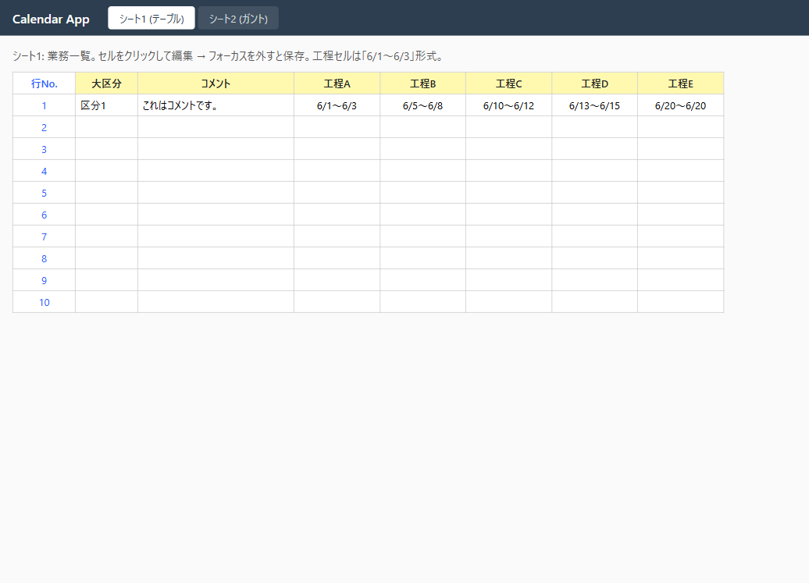
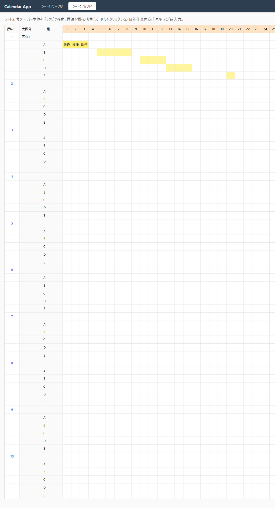

# DD-001-2: ざっくりモック

| 作成日 | 更新日 | ステータス |
|--------|--------|------------|
| 2026-05-21 | 2026-05-21 | 進行中 |

> アプローチ: モック先行（画面新規作成のため、レイアウト・操作感の合意が必要）。
> 親DD: [DD-001](DD-001_環境構築とざっくりモック.md)
> 前提DD: [DD-001-1](DD-001-1_環境構築.md) 完了

## 目的

DD-001-1 で構築した環境上に、Excelの2シート構成をWeb化した「ざっくり動くモック」を作る。

- シート1（テーブル画面）: 業務一覧。大区分・コメント・工程ごとの開始日〜終了日を入力
- シート2（ガント画面）: 工程をバーで表示。ドラッグで移動・端を掴んでリサイズ・セルクリックで日別作業内容を入力
- 両画面で同じデータ（`Job.data` JSON）を編集 → どちらで直しても同期する

## 背景・課題

- データモデルがまだ動的に変わる可能性 → JSON型でゆるく持つ
- ガントUIは案A(frappe-gantt)と案B(自作 dnd-kit)があり、本DDで実機検証して決める
- 「同期」が本企画の肝。サーバを介した1モデル2ビュー構成を最初の段階で通しておく

## 検討内容

### モック範囲（ざっくりの定義）

| 機能 | やる | やらない |
|---|---|---|
| 業務行の表示・追加 | ✅ | 削除はやらない |
| 大区分・コメントの編集 | ✅ | |
| 工程の開始日〜終了日の編集（テーブル） | ✅ | |
| ガントバーの表示 | ✅ | |
| ガントバーのドラッグ移動 | ✅（採用ライブラリ次第） | |
| ガントバーのリサイズ | ✅（採用ライブラリ次第） | |
| 日別作業内容（「洗浄」など）の入力 | ✅ | |
| 認証・権限 | | ✅ |
| 複数ユーザの同時編集対策 | | ✅ |
| 月またぎ・年単位ビュー | | ✅（当面1ヶ月固定でよい） |

### データモデル（JSON）

```typescript
// Zod schema: src/lib/schemas.ts
const StepSchema = z.object({
  name: z.string(),                       // "A" / "B" / ...
  startDate: z.string(),                  // "2026-06-01"
  endDate: z.string(),                    // "2026-06-03"
  dailyNotes: z.record(z.string(), z.string()), // {"2026-06-01": "洗浄", ...}
});
const JobDataSchema = z.object({
  category: z.string().nullable(),
  comment: z.string().nullable(),
  steps: z.array(StepSchema),
});
```

### ガントUI比較（Phase 1で実機判断）

| 観点 | 案A: frappe-gantt | 案B: 自作 (dnd-kit + table) |
|---|---|---|
| 工数 | 低 | 中〜高 |
| ドラッグ移動・リサイズ | 標準対応 | 自前実装 |
| セル単位のテキスト入力 | 別UI重ねる必要あり | ネイティブに実装可 |
| Excel感に近い | △ | ◎ |

### API

| Method | Path | 役割 |
|---|---|---|
| GET | `/api/jobs` | 全件取得 |
| PUT | `/api/jobs/:rowNo` | 作成 or 更新（upsert、`data` 丸ごとPUT） |

### ページ構成

| パス | コンポーネント | 役割 |
|---|---|---|
| `/sheet` | `SheetPage` | テーブル表示・編集（シート1相当） |
| `/gantt` | `GanttPage` | ガント表示・編集（シート2相当） |

ヘッダーでタブ切替。同じデータを React Query 経由で取得。編集 → PUT → invalidate → 反対側の画面でも反映、を確認する。

## 決定事項

- 1ヶ月固定でモックを作る（年月切り替えは別DDで）
- 月の表示範囲は **2026-06-01〜2026-06-30** 固定でよい（モック段階）
- ガントUIは Phase 1 で frappe-gantt 試作 → 操作感が不満なら案B(dnd-kit)に切替判断

## タスク一覧

### Phase 0: 事前精査

- [ ] 📋 タスク精査
- [ ] 📐 実装前詳細化トリガー判定
  - 規模シグナル: ✅ 新規モジュール・新規エンドポイント追加 → **詳細化要**
  - 複雑度シグナル: ⬜ 該当なし
  - 判定: Phase 1, Phase 2, Phase 3 → 詳細化要
- [ ] 😈 Devil's Advocate調査
  - **JSONを丸ごとPUTの上書きリスク**: 単独運用なら問題なし。複数編集が出てきたら `updatedAt` で楽観ロックを後で入れる
  - **frappe-gantt のスタイル干渉**: Tailwind 等と相性悪い可能性。ダメなら案Bへ
  - **日付文字列のタイムゾーンずれ**: `"YYYY-MM-DD"` 文字列で統一、Date 型はサーバ・フロントとも持たない

### Phase 1: HTMLモック作成

- [ ] 🎨 **HTMLモック作成**（添付 `DD-001-2/mock/`）
  - `mock/sheet.html`: テーブル画面のレイアウト（大区分/コメント/工程A〜Eの列、10行）
  - `mock/gantt.html`: ガント画面のレイアウト（工程をバーで、1〜30日の横軸、セル内テキスト表示）
  - インタラクションは静的でよい（ボタン・入力フィールドは見た目だけ）
  - 元のExcelキャプチャ画像も `DD-001-2/` に配置して比較できるようにする
- [ ] 👀 **ユーザーレビュー（ゲート）**
  - レイアウト・配色・操作感（想定）について合意
  - フィードバック反映 → 再レビュー
  - **合意後に Phase 2 へ**
- [ ] 😈 **DA批判レビュー**

### Phase 2: BE実装

- [ ] 📐 **実装前詳細化**
  - `src/routes/jobs.ts`:
    - `GET /api/jobs` → `prisma.job.findMany({ orderBy: { rowNo: 'asc' } })` → `data` を `JSON.parse` してレスポンス
    - `PUT /api/jobs/:rowNo` → リクエストbodyを `JobDataSchema` で検証 → `prisma.job.upsert({ where: { rowNo }, create: {...}, update: {...} })`
  - エッジケース: 不正JSON、rowNoが負、空配列など
  - 👀 **ユーザーレビュー**（合意後に実装）
- [ ] `src/lib/schemas.ts` に Zod スキーマ実装
- [ ] `src/routes/jobs.ts` を上記仕様で実装
- [ ] 🔬 **機械検証**:
  - `curl -X PUT http://localhost:3000/api/jobs/1 -H "Content-Type: application/json" -d '{"category":"区分1","comment":"テスト","steps":[]}'` → 200
  - `curl http://localhost:3000/api/jobs` → 直前のデータが返る
  - 不正JSONを送る → 400
- [ ] 😈 **DA批判レビュー**

### Phase 3: FE実装

- [ ] 📐 **実装前詳細化**
  - 状態管理: React Query (`useQuery(['jobs'])` / `useMutation`)
  - `SheetPage.tsx`: HTMLテーブル、セル編集はinput直接、onBlurでPUT
  - `GanttPage.tsx`: 採用したガントUI（A or B）で実装、バー操作→PUT、セルクリック→テキスト入力モーダル or インライン編集
  - 共有: API client モジュール `src/client/lib/api.ts`
  - 👀 **ユーザーレビュー**（合意後に実装）
- [ ] ガントUI採用判断（frappe-gantt の試作で判断）
- [ ] `src/client/lib/api.ts` 実装
- [ ] `src/client/pages/SheetPage.tsx` 実装
- [ ] `src/client/pages/GanttPage.tsx` 実装
- [ ] ルーター設定（タブ切替）
- [ ] 🔬 **機械検証**:
  - ブラウザで `/sheet` を開いてセル編集 → リロード後も保持
  - `/gantt` に切替 → 編集内容が反映されている
  - 逆方向（ガントで編集 → シートで反映）も確認
- [ ] 📸 **エビデンス取得**（赤枠ハイライト付き、`DD-001-2/` 配下に `sheet-after-mock.png`、`gantt-after-mock.png`）
- [ ] 👀 **ユーザーレビュー（ゲート）**: モックUIの最終合意
- [ ] 😈 **DA批判レビュー**

## ログ

### 2026-05-21
- DD作成
- Phase 1 (HTMLモック) 完了: `DD-001-2/mock/sheet.html` / `DD-001-2/mock/gantt.html` 作成
- Phase 2 (BE) 完了: `src/routes/jobs.ts` に `GET /api/jobs` `GET /api/jobs/:rowNo` `PUT /api/jobs/:rowNo` を実装。`src/lib/schemas.ts` に Zod schema (`JobDataSchema` / `StepSchema`)
- 機械検証:
  - `curl -X PUT /api/jobs/2` 正常レスポンス確認
  - 不正日付で `curl -X PUT` → 400 + `{"steps":["must be YYYY-MM-DD"]}` 返却確認
- Phase 3 (FE) 完了: `src/client/pages/SheetPage.tsx` / `GanttPage.tsx` / `lib/api.ts` / `lib/dateUtils.ts` / `App.tsx` ルータ実装
- ガントUI: **案B(自作 pointer events + CSS Grid)** を採用。ドラッグ移動・両端リサイズ・セルクリック編集を実装
- 📸 エビデンス取得 (Playwright MCP)
- ガント画面のドラッグ操作・双方向同期の最終ユーザーレビュー待ち

## エビデンス

| シート1 (テーブル) | シート2 (ガント) |
|--------|-------|
|  |  |
| 元Excelシート1と同じ列構成、「6/1〜6/3」形式の期間表示。セル編集可。 | 元Excelシート2と同じ。工程A〜Eのバー、Aの「洗浄」3日連続、E(20日)の単日バーまで再現。 |

---

## DA批判レビュー記録

### Phase 1 DA批判レビュー

**DA観点:** （Phase 1 完了後に記入）

| # | 発見した問題/改善点 | 重要度 | 再現手順 | DA観点 | 対応 |
|---|-------------------|--------|---------|--------|------|

### Phase 2 DA批判レビュー

**DA観点:** （Phase 2 完了後に記入）

| # | 発見した問題/改善点 | 重要度 | 再現手順 | DA観点 | 対応 |
|---|-------------------|--------|---------|--------|------|

### Phase 3 DA批判レビュー

**DA観点:** （Phase 3 完了後に記入）

| # | 発見した問題/改善点 | 重要度 | 再現手順 | DA観点 | 対応 |
|---|-------------------|--------|---------|--------|------|
