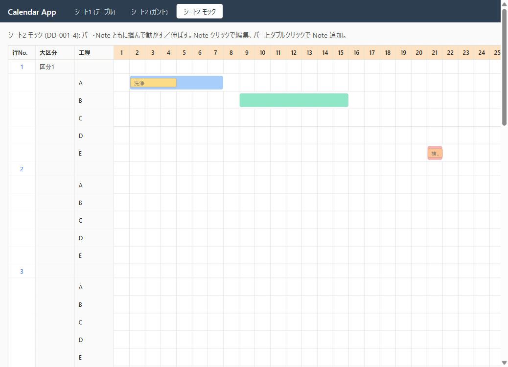
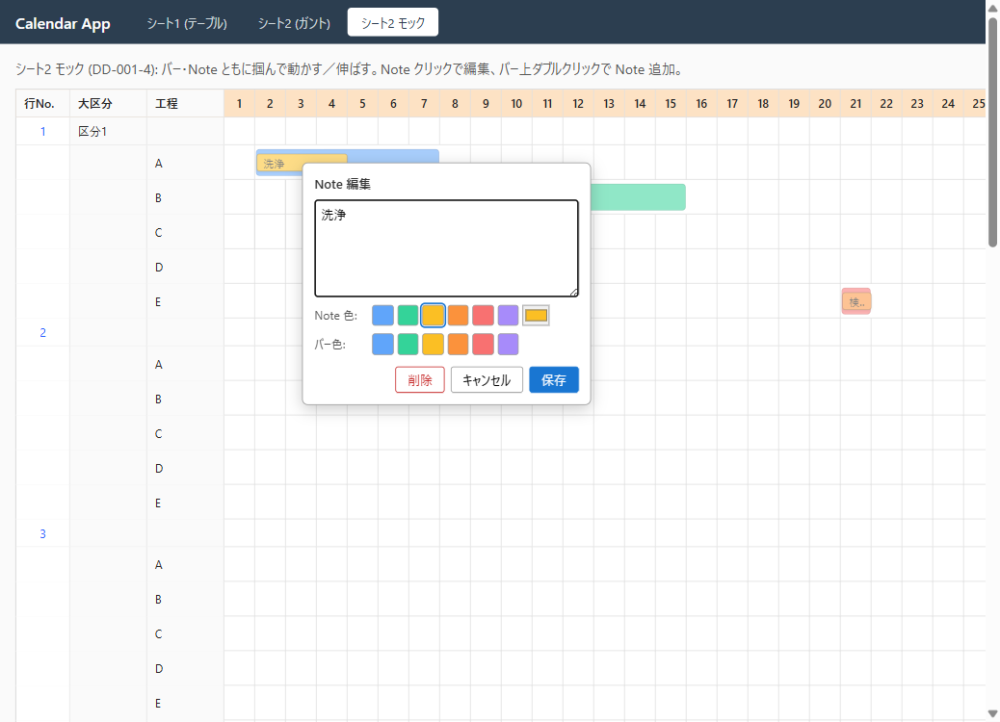

<!-- CLAUDE: DD作成時は templates/guides.md を必ず先に読むこと -->

# DD-001-4: ガントUI React モック

| 作成日 | 更新日 | ステータス |
|--------|--------|------------|
| 2026-05-21 | 2026-05-21 | 進行中 |

> アプローチ: モック先行（React 実装で操作感を合意）。HTMLモックでは「掴んで動かす」感が検証できないため。
> 親DD: [DD-001](DD-001_環境構築とざっくりモック.md)
> 関連DD: [DD-001-3](DD-001-3_期間ドラッグ拡張とシート間同期.md)（設計）, DD-001-5（本実装、未起票）

## 目的

DD-001-3 で整理した「オブジェクト指向ガントUI」の操作感を **React でそのまま動くモック** として作り、ユーザーレビューで操作感と決定事項4項目を合意する。

## 背景・課題

- 本DDの肝は「Googleカレンダー的に掴んで動かす」感 → 静的HTMLでは検証不能
- 本物の `/gantt` を壊さずに試したい → 独立ルート `/gantt-mock` で分離
- モックで書いた操作系コード（ドラッグ・リサイズ・ポップオーバー）は、合意後に DD-001-5 でほぼそのまま転用する

## 検討内容

### 配置

| 項目 | 値 |
|---|---|
| 新規ページ | [src/client/pages/GanttMockPage.tsx](../../src/client/pages/GanttMockPage.tsx) |
| ルート | `/gantt-mock` （[src/client/App.tsx](../../src/client/App.tsx) に追加） |
| ナビ | ヘッダに「シート2 モック」タブを追加（モック合意後に削除） |
| スタイル | [src/client/styles.css](../../src/client/styles.css) に `.gantt-mock-*` 名前空間で追記 |

### データ管理

- **`useState` のみ。API・Prisma・サーバ往復なし**
- 初期データは [scripts/seed.ts](../../scripts/seed.ts) と同等のものを inline で持つ
- データ構造は本番想定に揃える（DD-001-5 で State をそのまま Zod スキーマ化できるように）

### 仮データモデル（モック内ローカル型）

```typescript
type Color = string  // "#3b82f6" 等

interface MockNote {
  id: string         // crypto.randomUUID()
  startDate: string  // "YYYY-MM-DD"
  endDate: string
  text: string       // 改行を含む長文可
  color?: Color
}

interface MockStep {
  name: string
  startDate: string
  endDate: string
  color?: Color
  notes: MockNote[]
}

interface MockJob { rowNo: number; category: string | null; comment: string | null; steps: MockStep[] }
```

### モック初期実装の仮置き（レビューで確定）

DD-001-3 の決定事項4項目は、まずモックで以下の値で実装してユーザーに見せ、合意 or 差し替え:

| 論点 | 仮置き |
|---|---|
| 色の選択方式 | プリセット6色 ＋ 自由カラーピッカー |
| Note 編集UI | バー外に浮かぶポップオーバー（textarea + 色選択） |
| Note 同士の重なり | 禁止（バリデーションで弾く） |
| バーの色 | ユーザー個別設定（パレット選択） |

### スコープ外

- API 接続・BE 変更（DD-001-5）
- 既存 `/gantt` の改修（DD-001-5）
- バー（工程）の新規作成・削除
- 月またぎ、複数月ビュー
- アクセシビリティ（キーボード操作、ARIA）— 本実装で対応

## 決定事項

モックレビュー（2026-05-21）でユーザー合意。仮置き4項目をそのまま採用:

- [x] 色: プリセット6色 ＋ 自由カラーピッカー
- [x] Note 編集UI: ポップオーバー（バー外に浮かぶカード）
- [x] Note 同士の重なり: 禁止
- [x] バー色: ユーザー個別設定（Note 編集ポップオーバー内）

詳細は [DD-001-3 決定事項](DD-001-3_期間ドラッグ拡張とシート間同期.md#決定事項) を参照。本DDのスコープは「モック作成」までで完了。本実装は DD-001-5 で行う。

## タスク一覧

### Phase 0: 事前精査

- [ ] 📋 タスク精査
- [ ] 📐 実装前詳細化トリガー判定
  - 規模シグナル: ✅ 新規モジュール（GanttMockPage） / ✅ 3ファイル以上の変更（page追加・App.tsx・styles.css）
  - 複雑度シグナル: ✅ ポインタイベントの入れ子（行・バー・Note の3層ドラッグ判定）
  - 判定: **詳細化要**
- [ ] 😈 Devil's Advocate 調査
  - **入れ子ドラッグの判定漏れ**: Note 掴んだつもりがバーが動く逆も。各レイヤで `stopPropagation` 必須
  - **モック→本実装の転用コスト**: useState のまま放置すると State 構造が肥大化。`MockNote` 型を最初から本番スキーマ想定に揃える
  - **長文Noteの省略表示**: バー内のスペースは横幅 32px/日。表示戦略（…省略・ホバーで全文・クリックで展開）をモック上で複数試す
  - **色のコントラスト**: 自由カラーピッカーで暗い色 → 白文字が読めない / 明るい色 → 黒文字が読めない。背景輝度から自動切替するか・プリセット限定するか

### Phase 1: モック実装 + 二段階レビュー

- [ ] 📐 **実装前詳細化**
  - 触るファイル: `src/client/pages/GanttMockPage.tsx`（新規）, `src/client/App.tsx`（route 追加）, `src/client/styles.css`（追記）
  - 主要関数:
    - `useDrag<T>({onMove, onEnd})`: 共通ポインタドラッグフック（バー・Note両方で再利用）
    - `cellFromClientX(clientX, gridLeft, cellPx) → date`: マウス位置→日付変換
    - `validateNoOverlap(notes, candidate) → boolean`: Note 重なり判定
  - データフロー: ローカル `useState<MockJob[]>` → JSX 再render。更新は immutable に
  - エッジケース: バー外への Note ドラッグ（バー境界でクランプ）、重複作成、空テキスト Note
  - 👀 **ユーザーレビュー**（実装方針合意後にコーディング開始）
- [ ] 🎨 モック実装（コミット粒度の目安）:
  1. レイアウト3レイヤ（行・バー・Note 静的表示、ハードコードデータ）
  2. バードラッグ移動・両端リサイズ
  3. Note ドラッグ移動・両端リサイズ（複数日対応）
  4. Note クリック → ポップオーバー編集（長文 textarea + 色選択）
  5. Note 新規作成（バー上ダブルクリック）
  6. バー色設定
- [ ] 👀 **中間ユーザーレビュー**: 1完了時点（レイアウト確認）
- [ ] 👀 **最終ユーザーレビュー（ゲート）**: 6完了時点
  - 決定事項4項目の確定
  - フィードバック反映 → 再レビュー
  - **合意後に DD-001-5（実装）起票へ**
- [ ] 🔬 **機械検証** (Playwright MCP):
  - `/gantt-mock` がロードされる
  - バーをドラッグ → 期間がずれる
  - Note をダブルクリック → ポップオーバーが開く・長文入力できる
  - Note 同士を重ねようとすると弾かれる
- [ ] 📸 エビデンス取得: `DD-001-4/mock-layout.png`、`DD-001-4/mock-drag.png`、`DD-001-4/mock-note-editor.png`
- [ ] 😈 DA批判レビュー（最低1件: 「このPhaseで何が壊れるか」）

## ログ

### 2026-05-21
- DD作成
- アプローチ確定: HTMLモックではなく React モック（`/gantt-mock` 独立ルート、`useState` のみ）
- Phase 1 一気通貫実装:
  - `src/client/pages/GanttMockPage.tsx` 新規（バー＋Noteタイル＋ポップオーバー編集）
  - `src/client/App.tsx` に `/gantt-mock` ルートとタブ追加
  - `src/client/styles.css` に `.gantt-mock-*` 名前空間で追記
  - `npm run build` 型チェック通過
  - Playwright で動作確認: レイアウト表示・Note クリック→ポップオーバー展開 OK
- **ユーザーレビュー合意**: 「これでOK」(決定事項4項目はモックの仮置きをそのまま採用)
- DD-001-4 完了。次は DD-001-5（本実装）を起票

## エビデンス（モック初版）

| 表示 | Note 編集ポップオーバー |
|---|---|
|  |  |
| 工程A: 青バー＋黄Note「洗浄」(3日), 工程B: 緑バー(7日), 工程E: 赤バー＋オレンジNote(単日, 長文) | 長文textarea, Note色6プリセット+カラーピッカー, バー色6プリセット, 削除/キャンセル/保存 |

---

## DA批判レビュー記録

### Phase 1 DA批判レビュー

**DA観点:** （Phase 1 完了後に記入）「3層ドラッグの判定漏れ・モック転用時の State 構造ミスマッチで何が壊れるか」

| # | 発見した問題/改善点 | 重要度 | 再現手順 | DA観点 | 対応 |
|---|-------------------|--------|---------|--------|------|
| 1 | （実装後に追記） | - | - | - | - |
