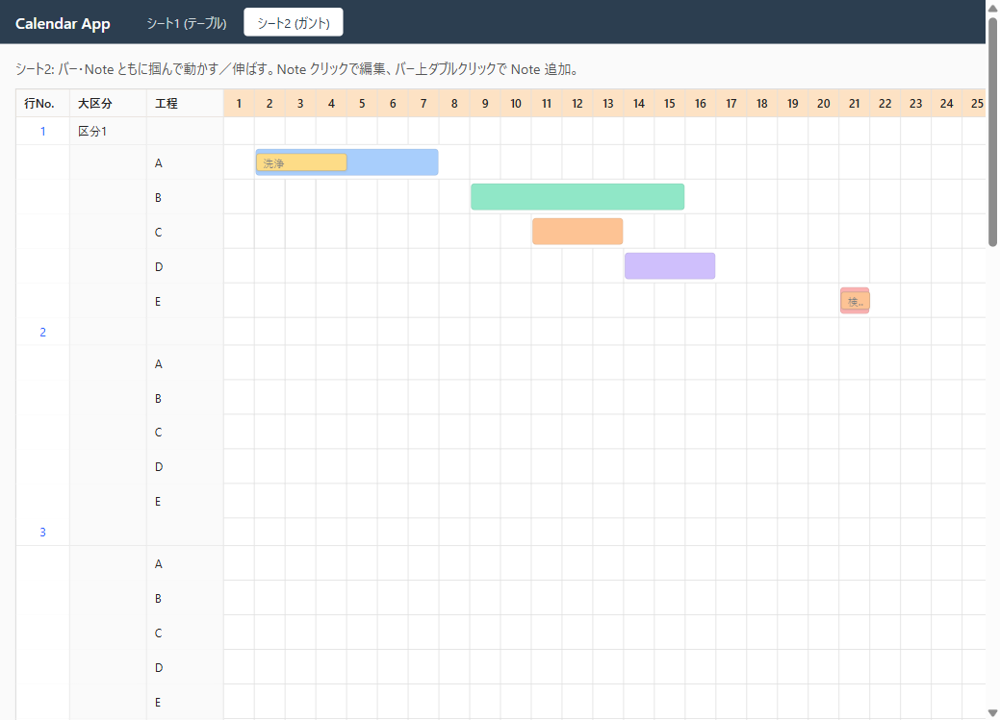
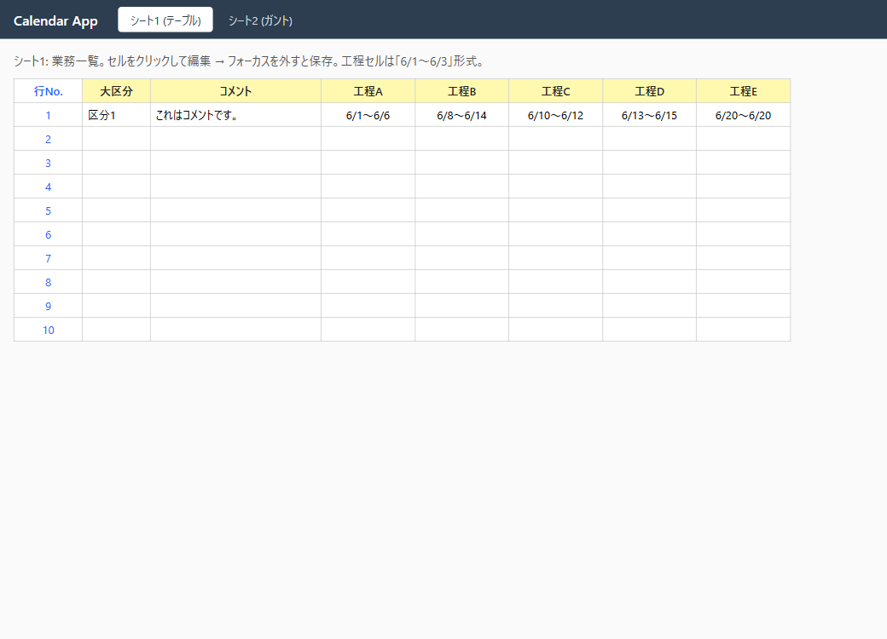

<!-- CLAUDE: DD作成時は templates/guides.md を必ず先に読むこと -->

# DD-001-5: ガントUI 本実装

| 作成日 | 更新日 | ステータス |
|--------|--------|------------|
| 2026-05-21 | 2026-05-21 | 完了 |

> アプローチ: 標準（モック済み・仕様確定済みのため探索的実装）。
> 親DD: [DD-001](DD-001_環境構築とざっくりモック.md)
> 前提DD: [DD-001-3](DD-001-3_期間ドラッグ拡張とシート間同期.md)（設計・決定事項）, [DD-001-4](DD-001-4_ガントUI_Reactモック.md)（モック合意済み）

## 目的

DD-001-4 で合意したモックを本実装としてシート2 (`/gantt`) に反映する。データモデル変更（`dailyNotes` → `notes[]` + `color`）、API 経由でのDB永続化、シート1との双方向同期を実現。

## 背景・課題

- モック `/gantt-mock` は `useState` のみで永続化なし → 本物のページで DB 永続化が必要
- データモデル変更（`Step.dailyNotes` 廃止、`Step.notes[]` / `Step.color` / `Note` 新設）が伴う
- モック段階のため後方互換不要（`db:reset` で初期化）

## 検討内容

### データモデル変更（src/lib/schemas.ts）

```typescript
const NoteSchema = z.object({
  id: z.string(),
  startDate: DateStringSchema,
  endDate: DateStringSchema,
  text: z.string(),
  color: z.string().optional(),
})

export const StepSchema = z.object({
  name: z.string(),
  startDate: DateStringSchema,
  endDate: DateStringSchema,
  color: z.string().optional(),
  notes: z.array(NoteSchema).default([]),  // dailyNotes 廃止
})
```

### 変更ファイル

| ファイル | 内容 |
|---|---|
| [src/lib/schemas.ts](../../src/lib/schemas.ts) | `NoteSchema` 追加、`StepSchema` 変更 |
| [src/client/pages/GanttPage.tsx](../../src/client/pages/GanttPage.tsx) | モック構造で全面書き直し + API接続 |
| [src/client/pages/SheetPage.tsx](../../src/client/pages/SheetPage.tsx) | `setStep` を `notes`/`color` 保持に対応 |
| [scripts/seed.ts](../../scripts/seed.ts) | 新スキーマで書き換え |
| [src/client/App.tsx](../../src/client/App.tsx) | `/gantt-mock` ルート＆タブ削除（Phase 4） |
| 削除: [src/client/pages/GanttMockPage.tsx](../../src/client/pages/GanttMockPage.tsx) | Phase 4 でクリーンアップ |

### スコープ外

- 月またぎ・複数月ビュー
- API 楽観ロック（複数ユーザ同時編集）
- アクセシビリティ（キーボード・ARIA）
- リッチテキスト・Markdown

## 決定事項

- DB 移行: `db:reset` で初期化（後方互換なし）
- Note の id: クライアント生成（`crypto.randomUUID()`）
- モックは Phase 4 で削除（残骸を残さない）

## タスク一覧

### Phase 0: 事前精査

- [ ] 📋 タスク精査
- [ ] 📐 詳細化判定: ✅ 3ファイル以上 / ✅ 外部I/F変更（Zod schema） / ✅ データ移行 → **詳細化要**
- [ ] 😈 DA 調査
  - **API PUT のレース**: ドラッグ中に複数 PUT が飛ぶ可能性 → モック同様 draft 状態を持ち、`pointerup` で1回だけ PUT
  - **既存 seed 互換性**: `dailyNotes` を削除するため `db:reset` が必須、既存 dev.db は破棄
  - **シート1の表示への影響**: SheetPage は `dailyNotes` を表示していない（`rangeLabel` のみ）→ `setStep` で `notes`/`color` を保持するだけでOK

### Phase 1: BE schema 変更 + seed

- [ ] 📐 実装前詳細化
  - `src/lib/schemas.ts`: `NoteSchema` 追加、`StepSchema` から `dailyNotes` 削除、`notes`/`color` 追加
  - `scripts/seed.ts`: サンプル業務(行No.1)の `dailyNotes: {...}` を `notes: [{id, startDate, endDate, text, color}]` 形式に変換
- [ ] `src/lib/schemas.ts` 更新
- [ ] `scripts/seed.ts` 更新
- [ ] 🔬 機械検証:
  - `npm run build` → 型OK
  - `npm run db:reset` → seed 投入成功
  - `curl http://localhost:3000/api/jobs` → 新形式（`notes` 配列・`color`）で返る

### Phase 2: FE GanttPage 本実装

- [ ] 📐 実装前詳細化
  - GanttMockPage の構造（StepRow + NoteTile + Popover + useDrag pattern）をそのまま採用
  - 差分: `useState` ではなく `useQuery(['jobs'])` でデータ取得、各操作で `mutation.mutate({rowNo, data})` を呼ぶ
  - 操作の粒度: drag 中は local draft、pointerup で1回 PUT
- [ ] `src/client/pages/GanttPage.tsx` 全面書き直し
- [ ] 🔬 機械検証 (Playwright):
  - `/gantt` でバーをドラッグ → 期間更新 → リロードしても保持
  - Note クリック → ポップオーバー → 編集 → 保存 → リロードしても保持
  - シート1に切替 → 期間がシート2の変更を反映している（双方向同期確認）

### Phase 3: SheetPage 修正

- [ ] `src/client/pages/SheetPage.tsx` の `setStep` を `notes`/`color` 保持に修正
- [ ] 🔬 機械検証 (Playwright):
  - シート1で工程セル編集 → シート2で期間が反映、Note は保持されている

### Phase 4: モック削除（クリーンアップ）

- [ ] `src/client/pages/GanttMockPage.tsx` 削除
- [ ] `src/client/App.tsx` から `/gantt-mock` ルートとタブを削除
- [ ] 🔬 機械検証: `/gantt-mock` が 404、`/gantt` `/sheet` は動作
- [ ] 📸 エビデンス取得（`DD-001-5/gantt-final.png`、`sheet-final.png`）
- [ ] 👀 **最終ユーザーレビュー（ゲート）**
- [ ] 😈 DA批判レビュー

## ログ

### 2026-05-21
- DD作成
- Phase 1: `src/lib/schemas.ts` に `NoteSchema` 追加・`StepSchema` に `notes`/`color` 追加・`dailyNotes` 削除。`scripts/seed.ts` を新形式で書き換え。`npm run db:reset && npm run db:seed` で投入成功
- Phase 2: `src/client/pages/GanttPage.tsx` をモック構造で全面書き直し、`useQuery`/`useMutation` で API 接続
- Phase 3: `src/client/pages/SheetPage.tsx` の `setStep` を `notes`/`color` 保持に修正
- Phase 4: `src/client/pages/GanttMockPage.tsx` 削除、`src/client/App.tsx` から `/gantt-mock` ルートとタブ削除
- 機械検証: `npm run build` 通過、`curl /api/jobs/1` で新形式 (`notes` 配列・`color`) 返却確認
- Playwright 検証: `/gantt` で5色バー・Note 表示、`/sheet` で `6/1〜6/6` 等の新期間表示、`/gantt-mock` は404
- **DD-001-5 完了**

## エビデンス

| シート2 ガント | シート1 テーブル |
|--------|-------|
|  |  |
| 工程A〜E が個別色付きバー、Note「洗浄」(黄)/「検査完了」(橙)。タブからモック削除済み。 | 新サンプルデータ反映 (A: 6/1〜6/6, B: 6/8〜6/14, ...)。同一 `Job.data` から派生表示で双方向同期維持。 |
